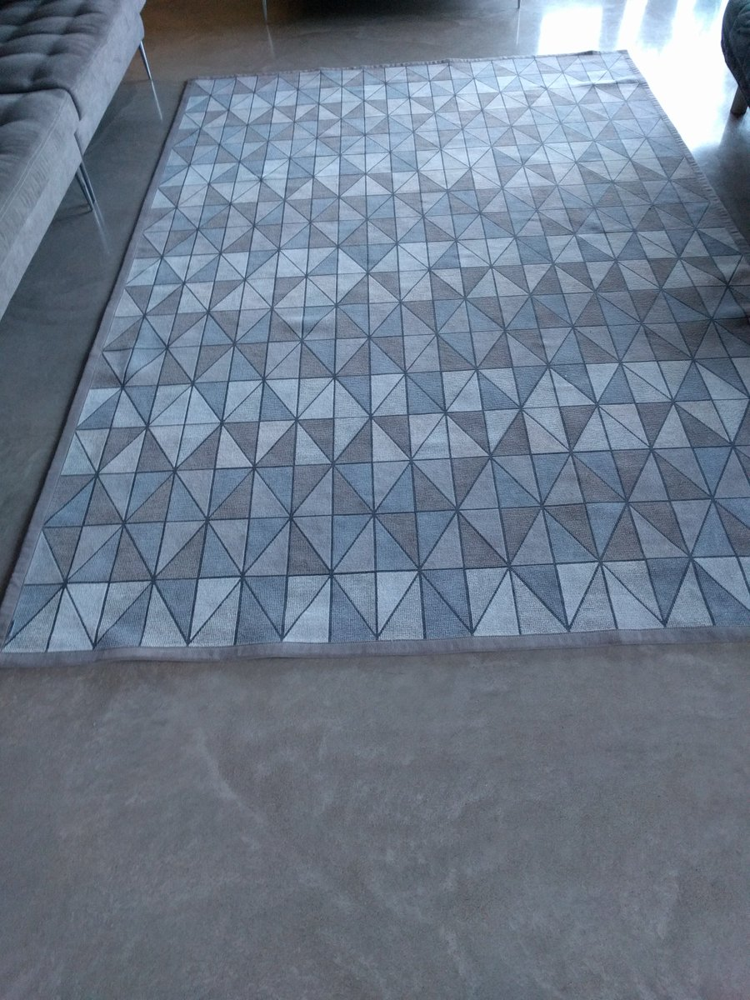

# Standup Maths Rug Puzzle #

This is a solution to the Rug Puzzle given by Matt Parker:

* https://twitter.com/standupmaths/status/981178738594533376
* https://www.youtube.com/watch?v=HViA6N3VeHw



I made this just for fun (and it really worth it), so it' not optimized or anything. I spent more time inside the mathematical solution on my white board than inside the code itself :smile:

## Running the code

To run it, you have those options:

* with [node.js](https://nodejs.org/en/):
	```
	node main.js [rows] [cols]
	```
	Both parameters are optional. Their default values are 18 and 20. The original values of the puzzle.

* with [JSFiddle](https://jsfiddle.net):<br>
	Copy and paste the code inside a jsfille and run it. To see the result you need to open the developer tools of your browser. Change the variables `input_rows` and `input_cols` to see other results besides the original ones.

